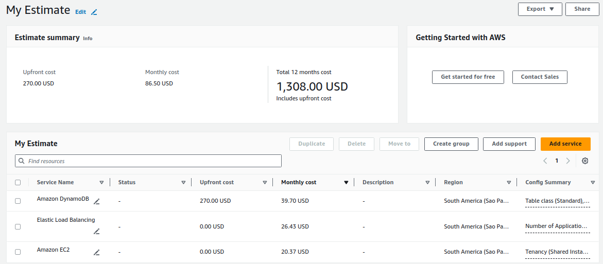

# Documentação do Projeto AWS

### Rodrigo Medeiros

## Sumário

- [Diagrama da Arquitetura AWS](#diagrama-da-arquitetura-aws)
- [Decisões Técnicas](#decisões-técnicas)
- [Guia Passo a Passo para a Execução dos Scripts](#guia-passo-a-passo-para-a-execução-dos-scripts)
- [Relatório de Custos Detalhado](#relatório-de-custos-detalhado)
- [Otimizações Possíveis](#otimizações-possíveis)
- [Conclusão](#conclusão)
- [Referências](#referências)

## Diagrama da Arquitetura AWS


## Decisões Técnicas

### Formato e Estrutura

Optei pelo uso do AWS CloudFormation em YAML. Essa abordagem permite gerenciar a infraestrutura como código, facilitando a criação, atualização e manutenção dos recursos AWS de forma declarativa. É preferível o uso de YAML ao invés de JSON devido à sua maior legibilidade e suporte a comentários, o que torna a compreensão e manutenção dos templates mais simples.

### Parâmetros

- **InstanceType**: O tipo de instância EC2 é configurável via parâmetro, com valor padrão `t2.micro`. Isso oferece flexibilidade na escolha do tipo de instância, permitindo ajustes para diferentes ambientes (desenvolvimento, teste, produção) sem modificar o template.
- **MinInstances**: Define o número mínimo de instâncias no Auto Scaling Group, com valor padrão de 2. Isso garante a disponibilidade mínima da aplicação mesmo em caso de falha de instâncias, assegurando resiliência.
- **MaxInstances**: Define o número máximo de instâncias no Auto Scaling Group, com valor padrão de 10. Isso limita o escalonamento para controlar custos e evitar sobrecarga do sistema.
- **DynamoDBTableName**: Nome da tabela DynamoDB configurável via parâmetro, com valor padrão `UsersTable`. Proporciona flexibilidade para usar diferentes nomes de tabela conforme as necessidades do projeto, facilitando a reutilização do template.
- **ImageId**: ID da AMI para as instâncias EC2, configurável via parâmetro, com valor padrão **'ami-0cdc2f24b2f67ea17'** que é a Amazon Linux 2 AMI (HVM), SSD Volume Type. Isso permite a flexibilidade de usar diferentes AMIs conforme as necessidades do projeto, facilitando a adaptação do ambiente para diferentes requisitos e regiões.

### Recursos

- **VPCResource**: Criação de uma VPC com CidrBlock de `10.0.0.0/16`. Permite o isolamento da rede para maior segurança e controle sobre a topologia de rede.
- **IGWResource**: Criação de um Internet Gateway. Permite que instâncias na VPC se conectem à internet, essencial para atualizações de software e comunicação externa.
- **RouteTableResource e RouteInternet**: Criação de uma tabela de rotas e uma rota padrão para o Internet Gateway. Gerencia o tráfego de rede, permitindo acesso à internet para sub-redes públicas.
- **PrimaryPublicSubnet e SecondaryPublicSubnet**: Criação de duas sub-redes públicas em diferentes zonas de disponibilidade (`sa-east-1a` e `sa-east-1c`). Isso distribui os recursos em múltiplas zonas de disponibilidade para alta disponibilidade e tolerância a falhas.
- **PrimarySubnetRouteAssoc e SecondarySubnetRouteAssoc**: Associação das sub-redes públicas à tabela de rotas. Garante que as sub-redes públicas tenham rotas para o Internet Gateway, permitindo a conectividade externa.
- **AutoScalingLaunchConfig**: Criação de uma configuração de lançamento EC2 com ImageId e InstanceType. Define parâmetros padrão para o lançamento de instâncias EC2 no Auto Scaling Group, facilitando a consistência e automação.
- **EC2AutoScalingGroup**: Criação de um Auto Scaling Group com políticas de escala mínima e máxima configuráveis. Permite escalabilidade automática baseada na demanda, garantindo desempenho e otimização de custos.
- **ApplicationLoadBalancer e ALBHTTPListener**: Criação de um Application Load Balancer (ALB) e um listener na porta 80. Permite a distribuição de tráfego de entrada para instâncias EC2, melhorando a disponibilidade e balanceamento de carga.
- **UsersDynamoDBTable**: Criação de uma tabela DynamoDB com capacidade provisionada (5 RCU e 5 WCU). Fornece armazenamento de dados não relacional escalável e de alta performance para a aplicação.
- **DynamoDBIAMRole e CustomInstanceProfile**: Criação de um papel IAM com permissões para acessar DynamoDB e um perfil de instância associado. Facilita o gerenciamento seguro e controlado de permissões, permitindo que as instâncias EC2 interajam com o DynamoDB de forma segura.

### Outputs

Definição de outputs para **VPC ID**, **Subnet IDs**, **Auto Scaling Group Name**, **ALB DNS Name**, e **DynamoDB Table Name**. Isso facilita a recuperação e utilização de informações chave da infraestrutura provisionada, permitindo integração e verificação eficiente.

## Guia Passo a Passo para a Execução dos Scripts

### Comece clonando esse repositório em sua máquina

```bash
git clone https://github.com/rodme02/app_cloud.git
```

### Instalar o AWS CLI

Primeiro é necessário ter o AWS CLI instalado na máquina. Isso pode variar dependendo do sistema operacional. O [site oficial](https://docs.aws.amazon.com/cli/latest/userguide/getting-started-install.html) fornece informações de como instalar em cada OS.

### Configurar Credenciais AWS:

Rode o comando abaixo para configurar as credencias, você vai precisar inserir a sua Access Key ID e Secret Access Key. No campo region coloque **sa-east-1** e para output format **json**.

```bash
aws configure
```

### Criação da Stack:

> Se está tendo problema de permissão para executar os scripts rode `chmod +x <script>.sh`

A criação da stack pode ser feita executando o script `create_stack.sh` contido dentro da pasta `scripts_stack`.

Considerando que você já está dentro do diretório do projeto:

```bash
./scripts_stack/create_stack.sh
```

### Atualizar a Stack:

A atualização da stack pode ser feita assim:

```bash
./scripts_stack/update_stack.sh
```

### Deleção da Stack:

Para deletar a stack, rode:

```bash
./scripts_stack/delete_stack.sh
```

### Alguns scripts para testar a aplicação:

Criar um novo usuário:

```bash
./scripts_user/create_user.sh <id> <nome>
```

Dar GET em um usuário existente:

```bash
./scripts_user/get_user.sh <id>
```

Atualizar um usuário existente:

```bash
./scripts_user/update_user.sh <id> <nome>
```

Deletar um usuário:

```bash
./scripts_user/delete_user.sh <id>
```

Esses scripts já pegam o DNS do ALB para facilitar os testes.

## Relatório de Custos Detalhado

### Instâncias EC2
- **Tipo de Instância**: t2.micro.
- **Custo Mensal Aproximado**: $20.37/mês (considerando uma média de 3 instâncias).

### Elastic Load Balancer:
- **Custo Mensal Aproximado**: $26.43/mês (1 Application Load Balancer).

### DynamoDB
- **Custo _Upfront_**: $270.00.
- **Custo Mensal Aproximado**: $39.70/mês (para 1GB).

### Custo Total

  Somando todos os gastos, teremos um custo de $270.00 _upfront_ mais um valor de $86.50/mês.



## Otimizações Possíveis
- **Instâncias EC2**: Poderíamos utilizar instâncias reservadas que acabam sendo mais baratas do que as instâncias sob demanda que estou utilizando.
- **Auto Scaling**: Configurar políticas de escalabilidade para aumentar ou diminuir instâncias com base em métricas específicas como utilização de CPU se a aplicação for pesada nesse sentido.
- **DynamoDB**: Se os padrões de acesso à tabela DynamoDB forem imprevisíveis, considerar o modelo de capacidade sob demanda para evitar provisionamento excessivo. Além disso o banco de dados RDS seria uma boa opção, já que é mais barato que o DynamoDB.
- **Região**: A região escolhida também impacta diretamente nos custos, uma região como **us-east-1 (N. Virginia)** é mais barata do que a **sa-east-1 (São Paulo)** mas perderíamos desempenho por ela estar mais longe de pontenciais usuários.

## Conclusão

A configuração proposta estabelece uma infraestrutura robusta e escalável na AWS, utilizando AWS CloudFormation em YAML para gerenciar a infraestrutura como código. A flexibilidade dos parâmetros configuráveis permite ajustes dinâmicos para diferentes ambientes, enquanto a arquitetura inclui recursos essenciais como VPC isolada, sub-redes distribuídas, Internet Gateway, Application Load Balancer e DynamoDB. Isso garante alta disponibilidade, segurança e desempenho eficiente da aplicação.

As otimizações sugeridas, como o uso de instâncias EC2 reservadas e políticas de escalabilidade baseadas em métricas, visam reduzir custos sem comprometer a funcionalidade. A documentação detalhada e os scripts fornecidos facilitam a implementação e gestão da stack. Em resumo, a solução atende aos requisitos técnicos, de desempenho e eficiência de custos, garantindo uma operação eficiente e segura, com potencial de crescimento futuro.​

## Referências

- [AWS CloudFormation User Guide](https://docs.aws.amazon.com/AWSCloudFormation/latest/UserGuide/Welcome.html)
- [Amazon EC2 Instance Types](https://aws.amazon.com/ec2/instance-types/)
- [AWS VPC User Guide](https://docs.aws.amazon.com/vpc/latest/userguide/what-is-amazon-vpc.html)
- [Amazon DynamoDB Documentation](https://docs.aws.amazon.com/amazondynamodb/latest/developerguide/Introduction.html)
- [AWS Auto Scaling](https://aws.amazon.com/autoscaling/)
- [Application Load Balancers](https://docs.aws.amazon.com/elasticloadbalancing/latest/application/introduction.html)
- [AWS Pricing](https://aws.amazon.com/pricing/)
- [AWS CLI User Guide](https://docs.aws.amazon.com/cli/latest/userguide/cli-configure-quickstart.html)
- [CloudFormation Templates](https://docs.aws.amazon.com/AWSCloudFormation/latest/UserGuide/template-guide.html)
- [AWS IAM Roles](https://docs.aws.amazon.com/IAM/latest/UserGuide/id_roles.html)

### Link para o repositório

https://github.com/rodme02/app_cloud
