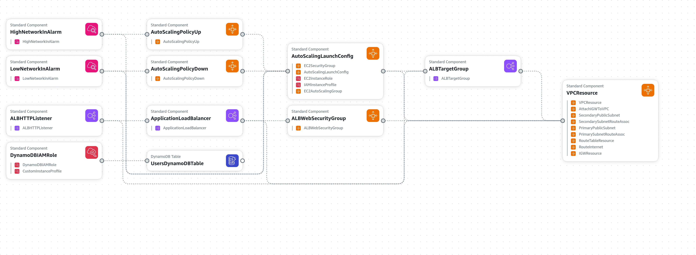

# Documentação do Projeto AWS

## Escolha da Região de Implantação

A escolha da região para implantação deve considerar tanto os custos quanto o desempenho.

- **Custos**: As tarifas de serviços AWS variam entre as regiões. Regiões como us-east-1 (N. Virginia) geralmente têm preços mais baixos comparados a outras regiões. Mas pro meu caso, perderíamos muito desempenho.

- **Desempenho**: Para minimizar a latência, escolhi a região mais próxima que é a sa-east-1 (São Paulo) por estar perto de potenciais usuários, diminuindo assim a latência.

## Diagrama da Arquitetura AWS



Coisas para incluir no diagrama:

VPC com sub-redes públicas e privadas
Instâncias EC2
Load Balancer (health checks)
Auto Scaling Groups
DynamoDB para banco de dados

## Decisões Técnicas

- **VPC**: Optei por uma VPC com sub-redes públicas e privadas para garantir segurança e controle de tráfego. As sub-redes privadas hospedam servidores de aplicação e banco de dados, enquanto as sub-redes públicas hospedam o load balancer.

- **EC2 e Auto Scaling**: Escolhi instâncias EC2 do tipo t2.micro por seu equilíbrio entre desempenho e custo. Configuramos Auto Scaling para ajustar automaticamente a capacidade com base na demanda.

- **Load Balancer**: Implementei um Application Load Balancer (ALB) para distribuir o tráfego de entrada entre as instâncias EC2. O ALB é configurado com regras baseadas em caminhos para rotear as solicitações.

- **Banco de Dados**: Usei o DynamoDB pela sua baixa latência e escalabilidade global. Alternativamente, eu poderia ter usado o MySQL por exemplo por sua facilidade de gerenciamento.

## Guia Passo a Passo para a Execução dos Scripts

### Comece clonando esse repositório em sua máquina

```bash
git clone https://github.com/rodme02/app_cloud.git
```

### Instalar o AWS CLI

Primeiro é necessário ter o AWS CLI instalado na máquina. Isso pode variar dependendo do sistema operacional. O [site oficial](https://docs.aws.amazon.com/cli/latest/userguide/getting-started-install.html) fornece informações de como instalar em cada OS.

### Configurar Credenciais AWS:

Rode o comando abaixo para configurar as credencias, você vai precisar insirir a sua Access Key ID e Secret Access Key. No campo region coloque **sa-east-1**.

```bash
aws configure
```

### Criação da Stack:

A criação da stack pode ser feita executando o script `create_stack.sh` contido dentro da pasta `scripts_stack`

Considerando que você já está dentro do diretório do projeto:

```bash
./scripts_stack/create_stack.sh
```

### Atualizar a Stack:

A atualização da stack pode ser feita assim:

```bash
./scripts_stack/update_stack.sh
```

### Deleção da Stack:

Para deletar a stack, rode:

```bash
./scripts_stack/delete_stack.sh
```

### Alguns scripts para testar a aplicação:

Criar um novo usuário:

```bash
./scripts_user/create_user.sh <id> <nome>
```

Dar GET em um usuário existente:

```bash
./scripts_user/get_user.sh <id>
```

Atualizar um usuário existente:

```bash
./scripts_user/update_user.sh <id> <nome>
```

Deletar um usuário:

```bash
./scripts_user/delete_user.sh <id>
```

Esses scripts já pegam o DNS do ALB para facilitar os testes.

## Previsão de Custos

### Principais Gastos:

- **EC2**: Custos baseados no tipo e quantidade de instâncias, uso por hora.
- **DynamoDB**: Custos baseados no tipo de instância de banco de dados e armazenamento.

## Possíveis Otimizações:

- **S3**: Poderia ser usado para armazenar objetos estáticos e backups devido à sua durabilidade e disponibilidade.
- **Reserved Instances**: Seria possível a compra de instâncias reservadas para reduzir custos a longo prazo.
- **Auto Scaling**: Configurar melhor para evitar custos excessivos durante picos de carga, principalmente dependendo da aplicação.
- **Lifecycle Policies**: Poderiamos usar políticas de ciclo de vida no S3 para mover dados antigos para classes de armazenamento mais baratas.

## Repositório com o Código CloudFormation

[Link do repositório]
