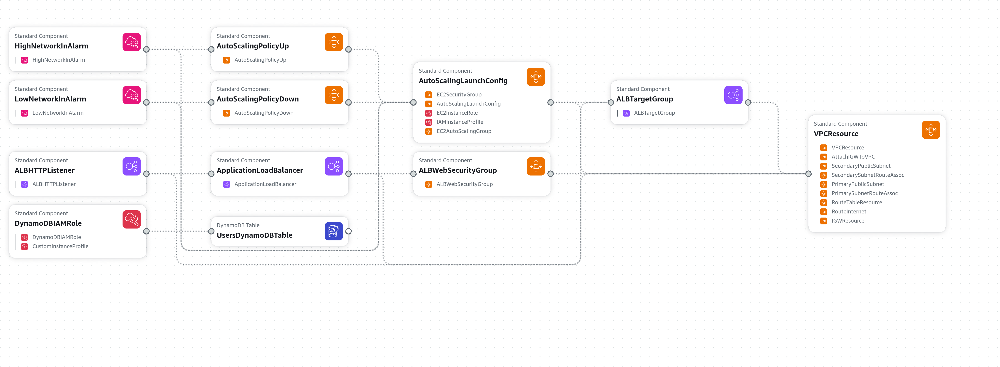

# Documentação do Projeto AWS

## Escolha da Região de Implantação

A escolha da região para implantação deve considerar tanto os custos quanto o desempenho.

- **Custos**: As tarifas de serviços AWS variam entre as regiões. Regiões como us-east-1 (N. Virginia) geralmente têm preços mais baixos comparados a outras regiões. Mas pro meu caso, perderíamos muito desempenho.

- **Desempenho**: Para minimizar a latência, escolhi a região mais próxima que é a sa-east-1 (São Paulo) por estar perto de potenciais usuários, diminuindo assim a latência.

## Diagrama da Arquitetura AWS



## Decisões Técnicas

### Formato e Estrutura

Optei pelo uso do AWS CloudFormation em YAML. Essa abordagem permite gerenciar a infraestrutura como código, facilitando a criação, atualização e manutenção dos recursos AWS de forma declarativa. É preferível o uso de YAML ao invés de JSON devido à sua maior legibilidade e suporte a comentários, o que torna a compreensão e manutenção dos templates mais simples.

### Parâmetros

- **InstanceType**: O tipo de instância EC2 é configurável via parâmetro, com valor padrão `t2.micro`. Isso oferece flexibilidade na escolha do tipo de instância, permitindo ajustes para diferentes ambientes (desenvolvimento, teste, produção) sem modificar o template.
- **MinInstances**: Define o número mínimo de instâncias no Auto Scaling Group, com valor padrão de 2. Isso garante a disponibilidade mínima da aplicação mesmo em caso de falha de instâncias, assegurando resiliência.
- **MaxInstances**: Define o número máximo de instâncias no Auto Scaling Group, com valor padrão de 10. Isso limita o escalonamento para controlar custos e evitar sobrecarga do sistema.
- **DynamoDBTableName**: Nome da tabela DynamoDB configurável via parâmetro, com valor padrão `UsersTable`. Proporciona flexibilidade para usar diferentes nomes de tabela conforme as necessidades do projeto, facilitando a reutilização do template.

### Recursos

- **VPCResource**: Criação de uma VPC com CidrBlock de `10.0.0.0/16`. Permite o isolamento da rede para maior segurança e controle sobre a topologia de rede.
- **IGWResource**: Criação de um Internet Gateway. Permite que instâncias na VPC se conectem à internet, essencial para atualizações de software e comunicação externa.
- **RouteTableResource e RouteInternet**: Criação de uma tabela de rotas e uma rota padrão para o Internet Gateway. Gerencia o tráfego de rede, permitindo acesso à internet para sub-redes públicas.
- **PrimaryPublicSubnet e SecondaryPublicSubnet**: Criação de duas sub-redes públicas em diferentes zonas de disponibilidade (`sa-east-1a` e `sa-east-1c`). Isso distribui os recursos em múltiplas zonas de disponibilidade para alta disponibilidade e tolerância a falhas.
- **PrimarySubnetRouteAssoc e SecondarySubnetRouteAssoc**: Associação das sub-redes públicas à tabela de rotas. Garante que as sub-redes públicas tenham rotas para o Internet Gateway, permitindo a conectividade externa.
- **EC2LaunchConfiguration**: Criação de uma configuração de lançamento EC2 com ImageId especificado e InstanceType configurável. Define parâmetros padrão para o lançamento de instâncias EC2 no Auto Scaling Group, facilitando a consistência e automação.
- **EC2AutoScalingGroup**: Criação de um Auto Scaling Group com políticas de escala mínima e máxima configuráveis. Permite escalabilidade automática baseada na demanda, garantindo desempenho e otimização de custos.
- **ApplicationLoadBalancer e LoadBalancerListener**: Criação de um Application Load Balancer (ALB) e um listener na porta 80. Permite a distribuição de tráfego de entrada para instâncias EC2, melhorando a disponibilidade e balanceamento de carga.
- **UsersDynamoDBTable**: Criação de uma tabela DynamoDB com capacidade provisionada (5 RCU e 5 WCU). Fornece armazenamento de dados não relacional escalável e de alta performance para a aplicação.
- **DynamoDBIAMRole e CustomInstanceProfile**: Criação de um papel IAM com permissões para acessar DynamoDB e um perfil de instância associado. Facilita o gerenciamento seguro e controlado de permissões, permitindo que as instâncias EC2 interajam com o DynamoDB de forma segura.

### Outputs

Definição de outputs para VPC ID, Subnet IDs, Auto Scaling Group Name, ALB DNS Name, e DynamoDB Table Name. Isso facilita a recuperação e utilização de informações chave da infraestrutura provisionada, permitindo integração e verificação eficiente.

## Guia Passo a Passo para a Execução dos Scripts

### Comece clonando esse repositório em sua máquina

```bash
git clone https://github.com/rodme02/app_cloud.git
```

### Instalar o AWS CLI

Primeiro é necessário ter o AWS CLI instalado na máquina. Isso pode variar dependendo do sistema operacional. O [site oficial](https://docs.aws.amazon.com/cli/latest/userguide/getting-started-install.html) fornece informações de como instalar em cada OS.

### Configurar Credenciais AWS:

Rode o comando abaixo para configurar as credencias, você vai precisar inserir a sua Access Key ID e Secret Access Key. No campo region coloque **sa-east-1**.

```bash
aws configure
```

### Criação da Stack:

A criação da stack pode ser feita executando o script `create_stack.sh` contido dentro da pasta `scripts_stack`.

Considerando que você já está dentro do diretório do projeto:

```bash
./scripts_stack/create_stack.sh
```

### Atualizar a Stack:

A atualização da stack pode ser feita assim:

```bash
./scripts_stack/update_stack.sh
```

### Deleção da Stack:

Para deletar a stack, rode:

```bash
./scripts_stack/delete_stack.sh
```

### Alguns scripts para testar a aplicação:

Criar um novo usuário:

```bash
./scripts_user/create_user.sh <id> <nome>
```

Dar GET em um usuário existente:

```bash
./scripts_user/get_user.sh <id>
```

Atualizar um usuário existente:

```bash
./scripts_user/update_user.sh <id> <nome>
```

Deletar um usuário:

```bash
./scripts_user/delete_user.sh <id>
```

Esses scripts já pegam o DNS do ALB para facilitar os testes.

## Relatório de Custos Detalhado

### Instâncias EC2
- Tipo de Instância: t2.micro.
- Custo Mensal Aproximado: $0.0116/h por instância. Com 2 a 10 instâncias rodando continuamente:
  - Mínimo: 2 * $0.0116/h * 730 horas = $16.94/mês.
  - Máximo: 10 * $0.0116/h * 730 horas = $84.70/mês.

### Application Load Balancer (ALB):
- Custo Base: $18.00/mês.
- Custo por Hora: $0.0225/h.
- Custo por GB de Dados Processados: $0.008/GB.

### DynamoDB
- Provisioned Throughput: 5 RCU e 5 WCU.
- 5 RCU: $0.0065 por hora.
- 5 WCU: $0.0065 por hora.
- Custo Mensal Aproximado: (5 * $0.0065 + 5 * $0.0065) * 730 = $47.45/mês.

## Otimizações Possíveis
- Reduzir o Tipo de Instância EC2: Escolher tipos de instância com menor custo para ambientes de teste ou desenvolvimento (no caso já estou usando a instância mais barata).
- Ajustar o Auto Scaling: Configurar políticas de escalabilidade para aumentar ou diminuir instâncias com base em métricas específicas como utilização de CPU se a aplicação for pesada nesse sentido.
- Usar DynamoDB On-Demand: Se os padrões de acesso à tabela DynamoDB forem imprevisíveis, considerar o modelo de capacidade sob demanda para evitar provisionamento excessivo.
- Eliminar Recursos Inativos: Monitorar e eliminar recursos que não estão sendo usados para evitar custos desnecessários.
- Reservar Instâncias EC2: Se a carga de trabalho for constante, considerar a compra de instâncias reservadas para reduzir custos a longo prazo.

## Conclusão
A configuração proposta fornece uma infraestrutura robusta e escalável na AWS. As decisões técnicas foram tomadas com base na necessidade de criar um ambiente altamente disponível e seguro, enquanto as otimizações propostas visam reduzir custos sem comprometer a funcionalidade e a performance da aplicação. ​

## Repositório com o Código CloudFormation

[Link do repositório]
